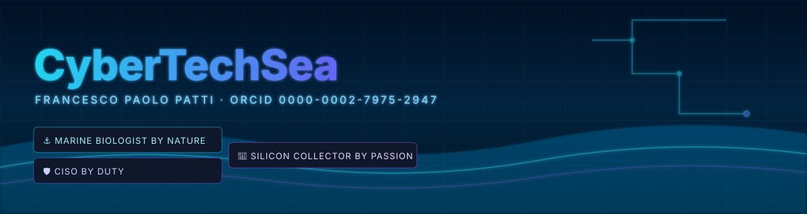
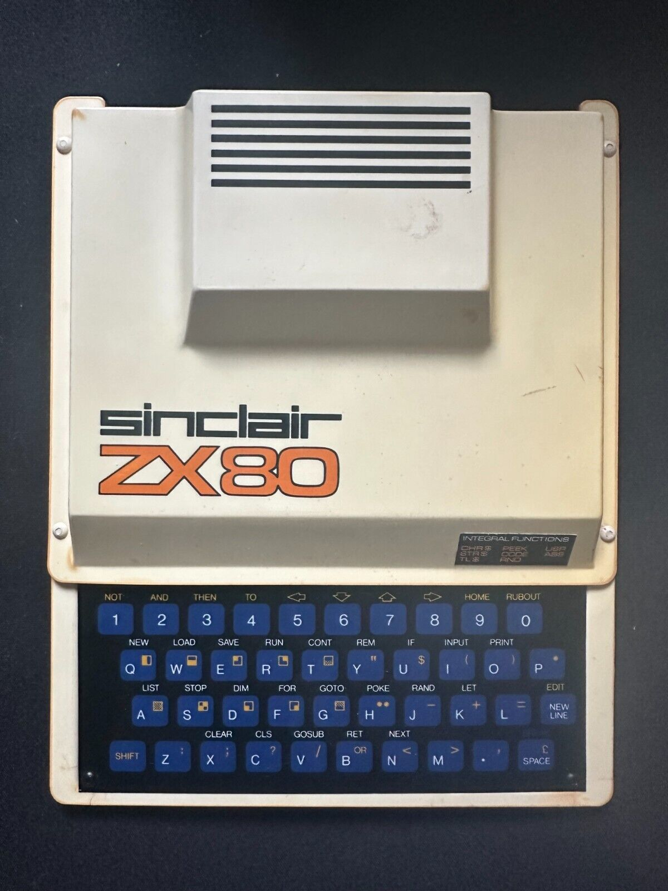
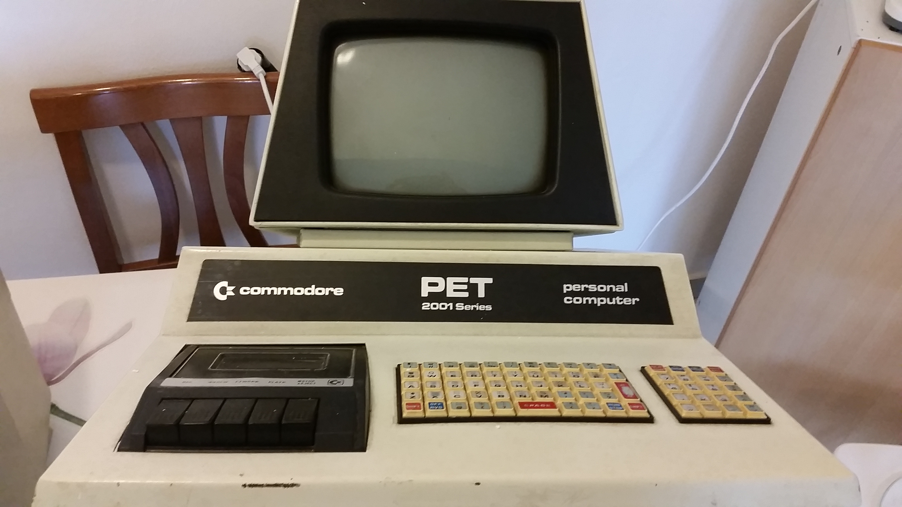
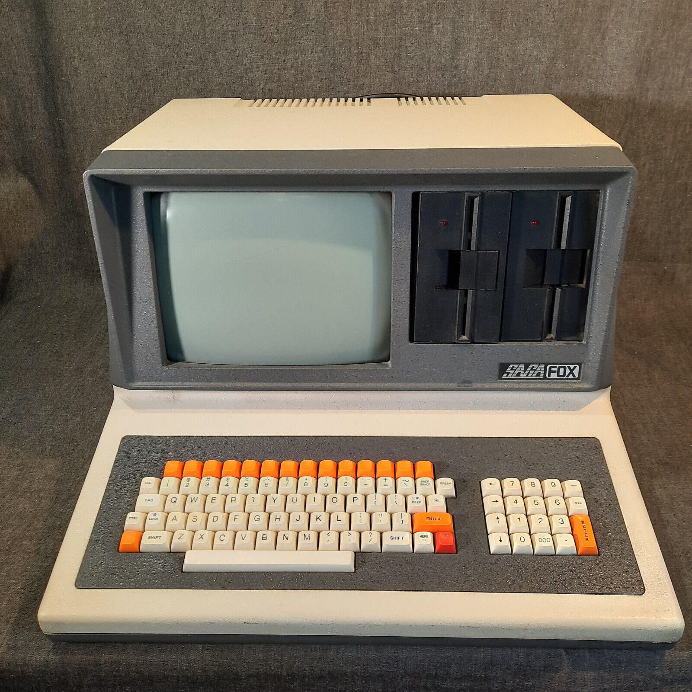
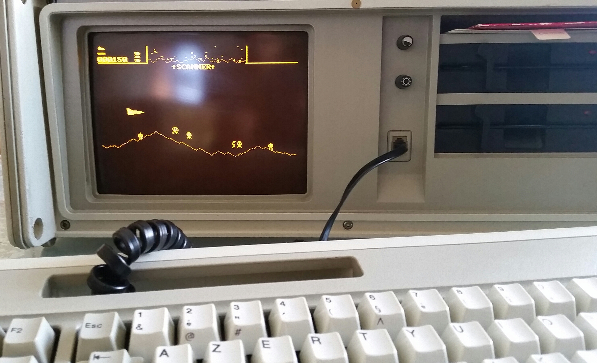

<!--
  Header template for CyberTechSea profile README.
  This file is the only place the banner is referenced.
  Edit it to swap the default theme banner.

  Three themes are available under assets/header/:
    - banner-retro.svg     → Retro Terminal / CRT
    - banner-deepsea.svg   → Deep-sea Cyberpunk
    - banner-museum.svg    → Museum Heritage

  To change the default banner, edit the  line below.
  All three banners stay available as clickable previews.
-->

<!-- ════════════════════════════════════════════════════════════════════════ -->
<!--                            DEFAULT BANNER                                 -->
<!-- ════════════════════════════════════════════════════════════════════════ -->

<p align="center">
  
</p>

<!-- ════════════════════════════════════════════════════════════════════════ -->
<!--                       THEME SWITCHER (3 previews)                         -->
<!-- ════════════════════════════════════════════════════════════════════════ -->
<!--
  GitHub READMEs do not execute JavaScript, so a real toggle is not possible.
  Instead the three banners are exposed as clickable thumbnails: clicking one
  opens the full-size SVG. To make a different theme the default, change the
   above to the chosen banner file.
-->

<p align="center">
  <i>Pick your view —</i>
  &nbsp;
  <a href="assets/header/banner-retro.svg" title="Retro Terminal theme">
    
  </a>
  <a href="assets/header/banner-deepsea.svg" title="Deep-sea Cyberpunk theme">
    
  </a>
  <a href="assets/header/banner-museum.svg" title="Museum Heritage theme">
    
  </a>
</p>

<!-- ════════════════════════════════════════════════════════════════════════ -->
<!--                              CLAIM                                        -->
<!-- ════════════════════════════════════════════════════════════════════════ -->

<h3 align="center">
  Marine biologist by nature &nbsp;·&nbsp; CISO by duty &nbsp;·&nbsp; Silicon collector by passion
</h3>

<p align="center">
  <a href="https://orcid.org/0000-0002-7975-2947"></a>
  <a href="https://youtube.com/@cybertechsea"></a>
  <a href="https://www.szn.it"></a>
  
</p>

---


<!--
  Section: 01 - The Origin Story
  Edit this file freely. The build script will assemble it into the final README.
-->

## 🕰️ The Origin Story — 1994

> *"This 2026 pipeline does what I dreamed of doing in 1994 — with ELEFAN, on a Stakar 486."*

It began on a **Stakar minitower (1994)**, DOS 6.1 with a Windows 3.1 shell. The first marine-biology thesis was written there, and the cohort analyses were run with **ELEFAN** — *Electronic Length Frequency Analysis* — the toolkit developed by **Daniel Pauly** in the early 1980s to estimate growth parameters of fish and invertebrate populations from length-frequency data. ELEFAN was the first widely-used numerical method for tropical fisheries science; its descendants live on today in the R package **TropFishR**.

That experience set the rule that still governs everything in this account:

> *Understand the biology first. Then make the machines serve it.*

Three decades and ten years as Chief Information Security Officer later, the same intent moves through every line of code published here.

<!-- PHOTO PLACEHOLDER: replace the line below with the Stakar 1994 photo when available
     Filename suggestion: assets/photos/stakar-1994.jpg
     Caption: "The Stakar minitower (1994) — where biology and code first met."
-->
<p align="center">
  
  <br/>
  <sub><i>The Stakar minitower (1994) — where biology and code first met. <br/>Photo coming soon.</i></sub>
</p>

---

<!--
  Section: 02 - The Archive
  The three pillars of CyberTechSea.
-->

## 📚 The Archive

<table>
<tr>
<td width="33%" valign="top" align="center">

### 🛡️ Cyber

**~10 years** as CISO, RTD<br/>(*Responsabile Transizione Digitale*) and Head of IT<br/>at the **Stazione Zoologica Anton Dohrn**.

Security-first design, threat modeling, governance of research infrastructures, digital-transition policies for a 150-year-old marine research institute.

*Every tool in this account is shaped by that decade.*

</td>
<td width="33%" valign="top" align="center">

### 💻 Tech

Scientific software for the **open-science era** — Python, FastAPI, JS, R.

Lagrangian dispersal modelling, phylogenetics, geometric morphometrics, GUI-driven pipelines for non-coding researchers, reproducible builds, Zenodo-archived releases.

*Production-grade code, written by someone who knows the data it carries.*

</td>
<td width="33%" valign="top" align="center">

### 🌊 Sea

Marine biologist by training, **molecular taxonomist** of benthic marine invertebrates today.

Scuba diver, Mediterranean shell collector, contributor to *Pinna nobilis* conservation science, digitiser of historical natural-history collections (Lo Bianco, Funk).

*The reason all of this exists.*

</td>
</tr>
</table>

---

<!--
  Section: 03 - Featured Projects
  Each card is rendered manually here so you can fully control its content.
  To add a new project, copy one of the <tr> blocks below.
-->

## 🚀 Featured Projects

<table>
<tr>
<td width="50%" valign="top">

### 🐚 [marine-larval-dispersal](https://github.com/CyberTechSea/marine-larval-dispersal)

A validated Python pipeline for **coastal Lagrangian dispersal modelling** in the Mediterranean, built on OceanParcels 3.x and CMEMS reanalysis. Resolves dependency conflicts and validates NEMO grid handling end-to-end.

`Python` · `OceanParcels` · `CMEMS` · `xarray` · `cartopy`

[](https://doi.org/10.5281/zenodo.19955061)

</td>
<td width="50%" valign="top">

### 🖥️ [marine-larval-dispersal-gui](https://github.com/CyberTechSea/marine-larval-dispersal-gui)

A **standalone graphical front-end** for the dispersal pipeline. Built for marine biologists with no command-line skills — drop-down menus, validated input fields, one-click simulation runs. FastAPI backend + HTML/JS frontend, multi-platform installers.

`FastAPI` · `HTML/JS` · `PyInstaller` · `cross-platform`

[](https://doi.org/10.5281/zenodo.20005233)

</td>
</tr>
<tr>
<td width="50%" valign="top">

### 🌳 [PhyloSuite](https://github.com/CyberTechSea/PhyloSuite)

An **integrated phylogenetic analysis pipeline** combining sequence fetching, MAFFT/MUSCLE alignment, substitution-model selection (ModelTest-NG), IQ-TREE 2 inference, and publication-ready PhyloWizard reports with auto-generated Methods sections — all in a single local web interface.

`Python` · `IQ-TREE 2` · `ModelTest-NG` · `MAFFT` · `MUSCLE`

[](https://doi.org/10.5281/zenodo.20023552)

</td>
<td width="50%" valign="top">

### 📐 [PyGeoMorph](https://github.com/CyberTechSea/PyGeoMorph)

A modern, all-in-one Python suite for **geometric morphometric analysis** of marine invertebrates. Replaces the fragmented tpsDig2 + tpsRelw + SPSS + SYSTAT workflow with GPA, RRPP, MANOVA, allometry (CAC/HOS), Elliptic Fourier Analysis, phylogenetic signal, modularity — in one local web app. Cross-platform CI/CD builds.

`Python` · `RRPP` · `morphometrics` · `bilingual EN/IT`

[](https://doi.org/10.5281/zenodo.20117484)

</td>
</tr>
</table>

---

<!--
  Section: 04 - Tech Heritage
  The vintage computers vault. Around 300 pieces from the 1970s-1990s.
  To rotate the "From the Vault" item, edit the marked block below.
-->

## 💾 Tech Heritage — The Vault

A personal collection of roughly **300 computers from the 1970s through the 1990s** — the silicon that taught a generation what computing felt like before the cloud.

<!-- ===== ROOTS OF THE ALGORITHMS ===== -->
### 🌱 Roots of the algorithms

Today's larval-dispersal pipeline lives on the shoulders of:

- **ELEFAN** *(Electronic Length Frequency Analysis)* — Pauly, D. & David, N. (1981). *ELEFAN I, a BASIC program for the objective extraction of growth parameters from length-frequency data.* **Meeresforschung**, 28(4): 205–211.
- **TropFishR** *(R package, modern descendant of ELEFAN)* — Mildenberger, T.K., Taylor, M.H. & Wolff, M. (2017). **Methods in Ecology and Evolution**, 8: 1520–1527. <https://doi.org/10.1111/2041-210X.12791>

These are not citations of convenience. They are the line of inheritance.

<!-- ===== FROM THE VAULT — rotate freely ===== -->
### 🗝️ This Month from the Vault

> *Edit this block whenever you want to feature a new piece from the collection.*

<table>
<tr>
<td width="40%" align="center">

<br/>
<sub><i>Photo coming soon.</i></sub>
</td>
<td width="60%" valign="top">

**Featured piece:** *(edit me)* — e.g. *Commodore PET 2001*, 1977.

**Why it matters:** *(edit me)* — a couple of lines about the machine, what it meant at the time, what it means to me now.

**Bridge to today:** *(edit me)* — what modern script or pipeline in this account echoes what this machine could (or could not) do.

</td>
</tr>
</table>

### 🖼️ Iconic pieces

<!-- A grid of the most iconic pieces. Replace alt text and filenames as photos arrive. -->

<table>
<tr>
<td align="center" width="25%"><br/><sub>Sinclair ZX80 · 1979</sub></td>
<td align="center" width="25%"><br/><sub>Commodore PET 2001· 1977</sub></td>
<td align="center" width="25%"><br/><sub>Saga Fox · 1980</sub></td>
<td align="center" width="25%"><br/><sub>IBM 5155 Portable Personal Computer · 1984</sub></td>
</tr>
</table>

<sub>📷 Photos are being progressively added — the collection counts ~300 pieces.</sub>

---

<!--
  Section: 06 - Legacy View (Easter egg)
  The dispersal map rendered both as PETSCII and as Amiga-palette pixel art.

  To replace this placeholder with a real simulation map:
    1. Save the real map as PNG in:  assets/easter-egg/dispersal.png
    2. Run:  python scripts/make_petscii.py assets/easter-egg/dispersal.png --cols 80
    3. The two outputs (dispersal-petscii.txt and dispersal-amiga.svg) will
       be regenerated. Commit them and the README will use them automatically.
-->

## 🕹️ Legacy View — for the patient scroller

A genuine larval-dispersal output rendered the way it would have looked on a **Commodore PET** (PETSCII glyphs) and on an **Amiga 1200** (16-colour palette).

A tribute to where the machines came from, by someone who still owns them.

<details>
<summary>📟  <b>PETSCII rendition</b> (Commodore PET style — click to expand)</summary>

<sub>Inlined from <a href="assets/easter-egg/dispersal-petscii.txt"><code>assets/easter-egg/dispersal-petscii.txt</code></a>:</sub>

<!-- BEGIN_PETSCII -->
```text
,,,,,,,,,,,,,,,,,,,,,,,,,,,,,,,,,,,.                                            
,,,,,,,,,,,,,,,,,,,,,,,,,,,,,,,,,,.                                             
,,,,,,,,,,,,,,,,,,,,,,,,,,,,,,,,.                                               
,,,,,,,,,,,,,,,,,,,,,,,,,,,,,,,.                                                
,,,,,,,,,,,,,,,,,,,,,,,,,,,,,.                                                  
,,,,,,,,,,,,,,,,,,,,,,,,,,,,.                                                   
,,,,,,,,,,,,,,,,,,,,,,,,,,,                                                     
,,,,,,,,,,,,,,,,,,,,,,,,..                                                      
,,,,,,,,,,,,,,,,,,,,..                                                          
..,,,,,,,,,,,,,,,..                                                             
     .....,,,..                                                                 
                                                                                
                     ::............                                             
                     :;...............                                          
                       .....................                                    
                         ..........................                             
                             ..........................                         
                                    .......................                     
                                        .....................   ...             
                                                . ..... ......  .               
                                                      .  .. ...                 
                                                               .
```
<!-- END_PETSCII -->

</details>

<details>
<summary>🎨  <b>Amiga 1200 pixel art</b> (16-colour mosaic — click to expand)</summary>

<p align="center">
  
</p>

</details>

<sub>🐚 *Currently using a procedurally generated placeholder. Replace `assets/easter-egg/_placeholder_dispersal.png` with a real OceanParcels output and re-run `scripts/make_petscii.py` to refresh both renditions.*</sub>

---

<!--
  Section: 05 - Publications & contact
  Selected publications are listed manually. ORCID provides the live full list.
-->

## 📖 Selected Publications

- Cabanellas-Reboredo, M., Vázquez-Luis, M., Mourre, B., **Patti, F.P.**, *et al.* (2019). *Tracking a mass mortality outbreak of pen shell *Pinna nobilis* populations: a collaborative effort of scientists and citizens.* **Scientific Reports**, 9, 13355. <https://doi.org/10.1038/s41598-019-49808-4>

- Criscione, F. & **Patti, F.P.** (2010). *Similar shells are not necessarily a reliable guide to phylogeny: Rissoa guerinii Recluz, 1843, and Rissoa lia (Monterosato, 1884) (Caenogastropoda: Rissoidae): a case study.* **The Nautilus**.

📑 **Full publication list:** [ORCID 0000-0002-7975-2947](https://orcid.org/0000-0002-7975-2947)

---

## 📡 Live from CyberTechSea

<!-- BEGIN_DYNAMIC_BLOCK -->
<!-- This block is auto-generated. Edits will be overwritten. -->

### 📺 Latest from YouTube — [@CyberTechSea](https://youtube.com/@cybertechsea)

<table><tr><td align='center' width='33%'><a href='https://www.youtube.com/watch?v=gXB8wNPpUfY'></a><br/><sub><b>La Notte dei Ricercatori 2024 - Ischia</b><br/><i>2025-09-08</i></sub></td><td align='center' width='33%'><a href='https://www.youtube.com/watch?v=rVHkei8hSEM'></a><br/><sub><b>Unboxing Lotto Repro Giochi per Amiga</b><br/><i>2025-09-05</i></sub></td></tr></table>


### 🧪 Latest Zenodo releases

- **[Archivio — un ecosistema aperto per catalogare e mettere in dialogo collezioni scientifiche e patrimonio librario digitalizzato](https://doi.org/10.5281/zenodo.21283130)** — v1.0.0 · 2026-07-09 · `10.5281/zenodo.21283130`
- **[S.O.N.A.R.  Surface & OSINT Network Assessment + Remediation](https://doi.org/10.5281/zenodo.20743593)** — v– · 2026-06-18 · `10.5281/zenodo.20743593`


### 📊 GitHub at a glance

<p align='center'></p>
<p align='center'></p>


<sub>🔄 Dynamic block last refreshed: 2026-08-03 07:44 UTC</sub>

<!-- END_DYNAMIC_BLOCK -->

---

## 📬 Contact

<table>
<tr>
<td width="50%" valign="top">

**Francesco Paolo Patti, PhD**<br/>
Marine Biologist · Molecular Taxonomist<br/>
**Stazione Zoologica Anton Dohrn — Ischia Marine Centre**<br/>
Naples, Italy

</td>
<td width="50%" valign="top">

🆔 [ORCID 0000-0002-7975-2947](https://orcid.org/0000-0002-7975-2947)<br/>
🐙 [GitHub @CyberTechSea](https://github.com/CyberTechSea)<br/>
📺 [YouTube @CyberTechSea](https://youtube.com/@cybertechsea)<br/>
🎓 [Google Scholar](https://scholar.google.com/citations?user=&user_id=)<br/>

</td>
</tr>
</table>

---
